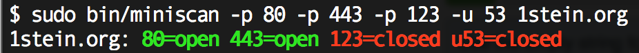
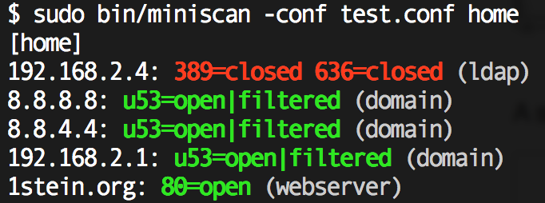

miniscan
========

A minimal port scanner for TCP and UDP port lists and network environments

It support two calling modes:
- with a port list and a number of hosts
 
  

- with a configuration file defining server profiles and network environments:
  
  

The configuration looks like this:

```
[profiles]
webserver=80
ldap=389,636
domain=u53

[home]
webserver=1stein.org
ldap=10.211.55.8
domain=192.168.2.1,8.8.8.8,8.8.4.4
ldap=192.168.2.4
```

Development
-----------

make

mkdir gonative
cd gonative
export GOPATH=$(pwd)
export PATH=$GOPATH/bin:$PATH
go get github.com/calmh/gonative
go get github.com/mitchellh/gox

cd ../go
export GOPATH=$(pwd)
gox github.com/sttts/miniscan
